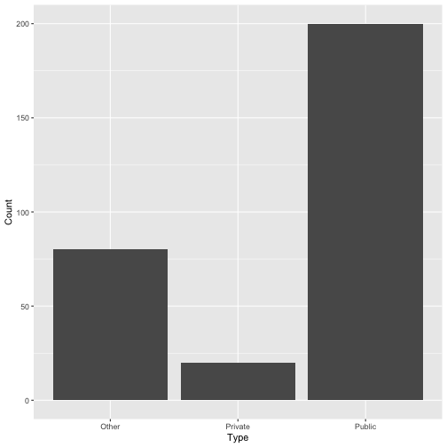

<style>
.reveal h1, .reveal h2, .reveal h3 {
  word-wrap: normal;
  -moz-hyphens: none;
}
</style>
<style>
.small-code pre code {
  font-size: 0.65em;
}
.medium-code pre code {
  font-size: 0.8em;
}
</style>


========================================================


## VISUAL ANALYTICS FOR POLICY AND MANAGEMENT
## Professor José Manuel MAGALLANES

### <p align="right">Intro to GGPLOT2</p>


Creating data
========================================================


```r
a=c("Public", "Private", "Other")
b=c(200, 20, 80)
inventedDF = data.frame(Type=a,
                        Count=b)
inventedDF
```

```
     Type Count
1  Public   200
2 Private    20
3   Other    80
```


Prepating ggplot2
========================================================


```r
a=c("Public", "Private", "Other")
b=c(200, 20, 80)
inventedDF = data.frame(Type=a,
                        Count=b)
####

library(ggplot2)

base=ggplot(data=inventedDF, 
            aes(x=Type,
                y=Count))
```

Default plot
========================================================
class:medium-code


```r
library(ggplot2)

base=ggplot(data=inventedDF,
            aes(x=Type,y=Count))

bar1= base + geom_bar(stat = 'identity') 
```

****

```r
bar1
```




Default plus Title
========================================================
class:medium-code


```r
# all text for titles
Titles=list(Ti="Nice title",
            STi="sub is here",
            XTi="Type of school",
            YTi="Amount of schools",
            Sou="Source: imaginary")

####
library(ggplot2)
base=ggplot(data=inventedDF,
            aes(x=Type,y=Count))

bar1= base + geom_bar(stat = 'identity')
#
# using texts
bar1= bar1 + labs(title = Titles$Ti,
                  subtitle = Titles$STi,
                  xlab=Titles$XTi,
                  ylab=Titles$YTi,
                  caption = Titles$Sou)
```

****

```r
bar1
```


Default plus annotating
========================================================
class:medium-code


```r
#texts for annotation
annots=list(forBar="HELLO")

####
library(ggplot2)
base=ggplot(data=inventedDF,
            aes(x=Type,y=Count))

bar1= base + geom_bar(stat = 'identity')
#
bar1= bar1 + labs(title = Titles$Ti,
                  subtitle = Titles$STi,
                  xlab=Titles$XTi,
                  ylab=Titles$YTi,
                  caption = Titles$Sou)
#annotating
bar1=bar1 + annotate(geom = 'text',
                     x = 2, y=30,
                     label=annots$forBar)
```
****

```r
bar1
```


Default changes: background
========================================================
class:medium-code


```r
library(ggplot2)
base= ggplot(data=inventedDF,
             aes(x=Type,y=Count)) 
# background
base= base + theme_classic()
#
bar1= base + geom_bar(stat = 'identity')

bar1= bar1 + labs(title = Titles$Ti,
                  subtitle = Titles$STi,
                  xlab=Titles$XTi,
                  ylab=Titles$YTi,
                  caption = Titles$Sou)

bar1=bar1 + annotate(geom = 'text',
                     x = 2, y=30,
                     label=annots$forBar)
```

****

```r
bar1
```


Default changes: position
========================================================
class:medium-code


```r
# label position on horizontal
NEWorder=c('Private','Other','Public')

####
library(ggplot2)
base= ggplot(data=inventedDF,aes(x=Type,y=Count)) 

base= base + theme_classic()

bar1= base + geom_bar(stat = 'identity')

bar1= bar1 + labs(title = Titles$Ti,
                  subtitle = Titles$STi,
                  xlab=Titles$XTi,
                  ylab=Titles$YTi,
                  caption = Titles$Sou)
#changes
bar1=bar1 + annotate(geom = 'text',
                     x = 1,y=30,
                     label=annots$forBar)
# repositioning bars
bar1= bar1 + scale_x_discrete(limits=NEWorder)
```
****

```r
bar1
```


Default changes: titles alignment
========================================================
class:small-code


```r
library(ggplot2)
base= ggplot(data=inventedDF,
             aes(x=Type,y=Count)) 

base= base + theme_classic()

bar1= base + geom_bar(stat = 'identity')

bar1= bar1 + labs(title = Titles$Ti,
                  subtitle = Titles$STi,
                  xlab=Titles$XTi,
                  ylab=Titles$YTi,
                  caption = Titles$Sou)

bar1= bar1 + annotate(geom = 'text',
                      x = 1,y=30,
                      label=annots$forBar)

bar1= bar1 + scale_x_discrete(limits=NEWorder)
# realignment of texts in titles
bar1= bar1 + theme(plot.title=element_text(hjust=0.5),
                   plot.subtitle=element_text(hjust=0.5),
                   plot.caption=element_text(hjust=0))
```

****

```r
bar1
```


Default changes: color and legend (1)
========================================================
class:small-code


```r
####
library(ggplot2)
base= ggplot(data=inventedDF,
             aes(x=Type,y=Count)) 

base= base + theme_classic()
# Adding variable for coloring
bar1= base + geom_bar(stat = 'identity',
                      aes(fill=Type)) 
#
bar1= bar1 + labs(title = Titles$Ti,
                  subtitle = Titles$STi,
                  xlab=Titles$XTi,
                  ylab=Titles$YTi,
                  caption = Titles$Sou)

bar1= bar1 + annotate(geom = 'text',x = 1,y=30,
                      label=annots$forBar)

bar1= bar1 + scale_x_discrete(limits=NEWorder)

bar1= bar1 + theme(plot.title=element_text(hjust=0.5),
                   plot.subtitle=element_text(hjust=0.5),
                   plot.caption=element_text(hjust=0))
# color and legend changes
bar1= bar1 + scale_fill_brewer(palette = "Accent") 
bar1= bar1 + guides(fill = "legend")
```


****

```r
bar1
```


Default changes: color and legend (2)
========================================================
class:small-code


```r
####
library(ggplot2)
base= ggplot(data=inventedDF,
             aes(x=Type,y=Count))

base= base + theme_classic()
# Adding variable for coloring
bar1= base + geom_bar(stat = 'identity',
                      aes(fill=Type)) 
#
bar1= bar1 + labs(title = Titles$Ti,
                  subtitle = Titles$STi,
                  xlab=Titles$XTi,
                  ylab=Titles$YTi,
                  caption = Titles$Sou)

bar1= bar1 + annotate(geom = 'text',
                      x = 1,y=30,
                      label=annots$forBar)

bar1= bar1 + scale_x_discrete(limits=NEWorder)

bar1= bar1 + theme(plot.title=element_text(hjust=0.5),
                   plot.subtitle=element_text(hjust=0.5),
                   plot.caption=element_text(hjust=0))
# color and legend changes
bar1= bar1 + scale_fill_brewer(palette = "Accent",
                               breaks=NEWorder) 
bar1= bar1 + guides(fill = "legend")
```


****

```r
bar1
```


Default changes: color and legend (3)
========================================================
class:small-code


```r
####
library(ggplot2)
base= ggplot(data=inventedDF,
             aes(x=Type,y=Count)) 

base= base + theme_classic()
# Adding variable for coloring
bar1= base + geom_bar(stat = 'identity',
                      aes(fill=Type)) 
#
bar1= bar1 + labs(title = Titles$Ti,
                  subtitle = Titles$STi,
                  xlab=Titles$XTi,
                  ylab=Titles$YTi,
                  caption = Titles$Sou)

bar1= bar1 + annotate(geom = 'text',
                      x = 1,y=30,
                      label=annots$forBar)

bar1= bar1 + scale_x_discrete(limits=NEWorder)

bar1= bar1 + theme(plot.title=element_text(hjust=0.5),
                   plot.subtitle=element_text(hjust=0.5),
                   plot.caption=element_text(hjust=0),
                   legend.position='top') # change
# color and legend changes
bar1= bar1 + scale_fill_brewer(palette = "Accent",
                               breaks=NEWorder) 
bar1= bar1 + guides(fill = "legend")
```


****

```r
bar1
```


Default changes: color and legend (4)
========================================================
class:small-code


```r
####
library(ggplot2)
base= ggplot(data=inventedDF,
             aes(x=Type,y=Count)) 

base= base + theme_classic()
# Adding variable for coloring
bar1= base + geom_bar(stat = 'identity',
                      aes(fill=Type)) 
#
bar1= bar1 + labs(title = Titles$Ti,
                  subtitle = Titles$STi,
                  xlab=Titles$XTi,
                  ylab=Titles$YTi,
                  caption = Titles$Sou)

bar1= bar1 + annotate(geom = 'text',
                      x = 1,y=30,
                      label=annots$forBar)

bar1= bar1 + scale_x_discrete(limits=NEWorder)

bar1= bar1 + theme(plot.title=element_text(hjust=0.5),
                   plot.subtitle=element_text(hjust=0.5),
                   plot.caption=element_text(hjust=0))

# color and legend changes
bar1= bar1 + scale_fill_brewer(palette = "Accent",
                               breaks=NEWorder) 
bar1= bar1 + guides(fill = "none")
```


****

```r
bar1
```


