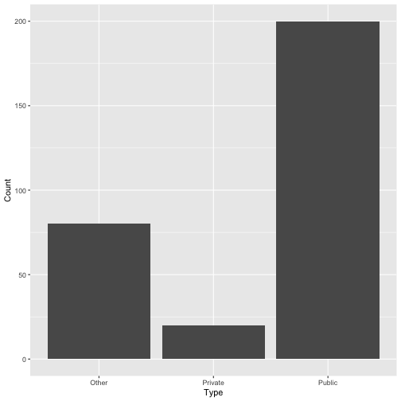
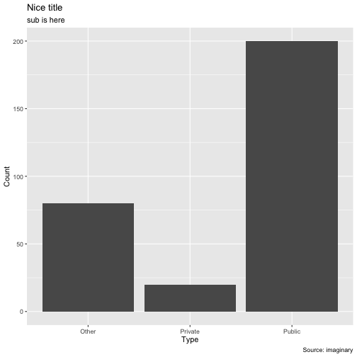
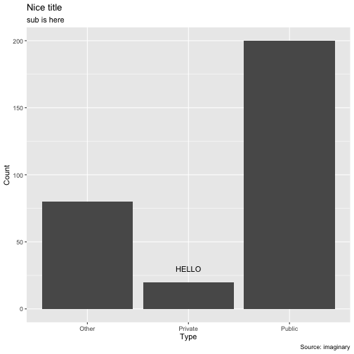
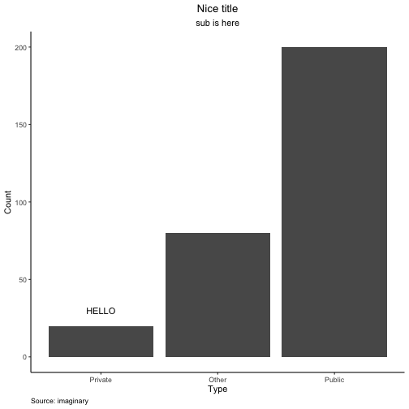
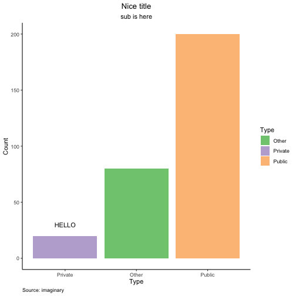
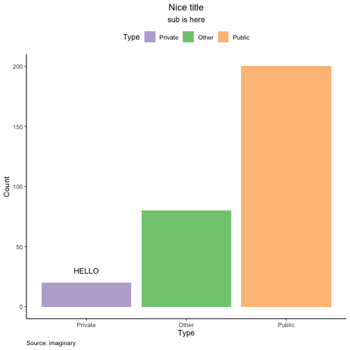
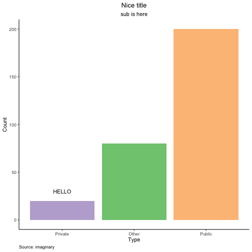

<style>
.reveal h1, .reveal h2, .reveal h3 {
  word-wrap: normal;
  -moz-hyphens: none;
}
</style>
<style>
.small-code pre code {
  font-size: 0.65em;
}
.medium-code pre code {
  font-size: 0.8em;
}
</style>


========================================================


## VISUAL ANALYTICS FOR POLICY AND MANAGEMENT
## Professor José Manuel MAGALLANES

### <p align="right">Tabular Data: Univariate Categorical</p>


Creating data
========================================================


```r
link='https://github.com/EvansDataScience/VisualAnalytics_2_tabularData/raw/master/data/eduwa.rda'

#getting the data TABLE from the file in the cloud:
load(file=url(link))

# first rows:
head(eduwa)
```

```
  NCES.School.ID State.School.ID NCES.District.ID State.District.ID Low.Grade
1   530486002475   WA-31025-1656          5304860          WA-31025         6
2   530270001270   WA-06114-1646          5302700          WA-06114        KG
3   530910002602   WA-34033-4500          5309100          WA-34033         9
4   530003000001   WA-14005-2834          5300030          WA-14005        PK
5   530825002361   WA-32081-1533          5308250          WA-32081         9
6   530966001632   WA-04246-3209          5309660          WA-04246        KG
  High.Grade                      School.Name                          District
1          8               10th Street School        Marysville School District
2         12              49th Street Academy Evergreen School District (Clark)
3         12 A G West Black Hills High School          Tumwater School District
4          6              A J West Elementary          Aberdeen School District
5         12  A-3 Multiagency Adolescent Prog           Spokane School District
6          5       Abraham Lincoln Elementary         Wenatchee School District
        County          Street.Address       City State   ZIP ZIP.4-digit
1    Snohomish        7204 27th Ave NE Marysville    WA 98271        <NA>
2        Clark   14619B NE 49th Street  Vancouver    WA 98682        6308
3     Thurston 7741 Littlerock Road SW   Tumwater    WA 98512        <NA>
4 Grays Harbor           1801 Bay Ave.   Aberdeen    WA 98520        5510
5      Spokane      1807 N. Washington    Spokane    WA 99205        <NA>
6       Chelan         1224 METHOW ST.  WENATCHEE    WA 98801        <NA>
          Phone Locale.Code LocaleType       LocaleSub Charter Title.I.School
1 (360)965-0400          22     Suburb Suburb: Midsize      No            Yes
2 (360)604-6700          12       City   City: Midsize      No             No
3 (360)709-7800          13       City     City: Small      No             No
4 (360)538-2131          33       Town    Town: Remote      No            Yes
5 (509)354-6299          12       City   City: Midsize      No             No
6 (509)663-5710          13       City     City: Small      No             No
  Title.1.School.Wide Student.Teacher.Ratio Free.Lunch Reduced.Lunch
1                 Yes                  23.4         28             3
2                <NA>                   8.4         53             9
3                <NA>                  21.5        169            40
4                 Yes                  15.9        292            10
5                <NA>                   6.5         12             4
6                <NA>                  15.3        411            23
```


Prepating ggplot2
========================================================


```r
a=c("Public", "Private", "Other")
b=c(200, 20, 80)
inventedDF = data.frame(Type=a,
                        Count=b)
####

library(ggplot2)

base=ggplot(data=inventedDF, 
            aes(x=Type,
                y=Count))
```

Default plot
========================================================
class:medium-code


```r
library(ggplot2)

base=ggplot(data=inventedDF,
            aes(x=Type,y=Count))

bar1= base + geom_bar(stat = 'identity') 
```

****

```r
bar1
```




Default plus Title
========================================================
class:medium-code


```r
# all text for titles
Titles=list(Ti="Nice title",
            STi="sub is here",
            XTi="Type of school",
            YTi="Amount of schools",
            Sou="Source: imaginary")

####
library(ggplot2)
base=ggplot(data=inventedDF,
            aes(x=Type,y=Count))

bar1= base + geom_bar(stat = 'identity')
#
# using texts
bar1= bar1 + labs(title = Titles$Ti,
                  subtitle = Titles$STi,
                  xlab=Titles$XTi,
                  ylab=Titles$YTi,
                  caption = Titles$Sou)
```

****

```r
bar1
```



Default plus annotating
========================================================
class:medium-code


```r
#texts for annotation
annots=list(forBar="HELLO")

####
library(ggplot2)
base=ggplot(data=inventedDF,
            aes(x=Type,y=Count))

bar1= base + geom_bar(stat = 'identity')
#
bar1= bar1 + labs(title = Titles$Ti,
                  subtitle = Titles$STi,
                  xlab=Titles$XTi,
                  ylab=Titles$YTi,
                  caption = Titles$Sou)
#annotating
bar1=bar1 + annotate(geom = 'text',
                     x = 2, y=30,
                     label=annots$forBar)
```
****

```r
bar1
```



Default changes: background
========================================================
class:medium-code


```r
library(ggplot2)
base= ggplot(data=inventedDF,
             aes(x=Type,y=Count)) 
# background
base= base + theme_classic()
#
bar1= base + geom_bar(stat = 'identity')

bar1= bar1 + labs(title = Titles$Ti,
                  subtitle = Titles$STi,
                  xlab=Titles$XTi,
                  ylab=Titles$YTi,
                  caption = Titles$Sou)

bar1=bar1 + annotate(geom = 'text',
                     x = 2, y=30,
                     label=annots$forBar)
```

****

```r
bar1
```


Default changes: position
========================================================
class:medium-code


```r
# label position on horizontal
NEWorder=c('Private','Other','Public')

####
library(ggplot2)
base= ggplot(data=inventedDF,aes(x=Type,y=Count)) 

base= base + theme_classic()

bar1= base + geom_bar(stat = 'identity')

bar1= bar1 + labs(title = Titles$Ti,
                  subtitle = Titles$STi,
                  xlab=Titles$XTi,
                  ylab=Titles$YTi,
                  caption = Titles$Sou)
#changes
bar1=bar1 + annotate(geom = 'text',
                     x = 1,y=30,
                     label=annots$forBar)
# repositioning bars
bar1= bar1 + scale_x_discrete(limits=NEWorder)
```
****

```r
bar1
```


Default changes: titles alignment
========================================================
class:small-code


```r
library(ggplot2)
base= ggplot(data=inventedDF,
             aes(x=Type,y=Count)) 

base= base + theme_classic()

bar1= base + geom_bar(stat = 'identity')

bar1= bar1 + labs(title = Titles$Ti,
                  subtitle = Titles$STi,
                  xlab=Titles$XTi,
                  ylab=Titles$YTi,
                  caption = Titles$Sou)

bar1= bar1 + annotate(geom = 'text',
                      x = 1,y=30,
                      label=annots$forBar)

bar1= bar1 + scale_x_discrete(limits=NEWorder)
# realignment of texts in titles
bar1= bar1 + theme(plot.title=element_text(hjust=0.5),
                   plot.subtitle=element_text(hjust=0.5),
                   plot.caption=element_text(hjust=0))
```

****

```r
bar1
```



Default changes: color and legend (1)
========================================================
class:small-code


```r
####
library(ggplot2)
base= ggplot(data=inventedDF,
             aes(x=Type,y=Count)) 

base= base + theme_classic()
# Adding variable for coloring
bar1= base + geom_bar(stat = 'identity',
                      aes(fill=Type)) 
#
bar1= bar1 + labs(title = Titles$Ti,
                  subtitle = Titles$STi,
                  xlab=Titles$XTi,
                  ylab=Titles$YTi,
                  caption = Titles$Sou)

bar1= bar1 + annotate(geom = 'text',x = 1,y=30,
                      label=annots$forBar)

bar1= bar1 + scale_x_discrete(limits=NEWorder)

bar1= bar1 + theme(plot.title=element_text(hjust=0.5),
                   plot.subtitle=element_text(hjust=0.5),
                   plot.caption=element_text(hjust=0))
# color and legend changes
bar1= bar1 + scale_fill_brewer(palette = "Accent") 
bar1= bar1 + guides(fill = "legend")
```


****

```r
bar1
```



Default changes: color and legend (2)
========================================================
class:small-code


```r
####
library(ggplot2)
base= ggplot(data=inventedDF,
             aes(x=Type,y=Count))

base= base + theme_classic()
# Adding variable for coloring
bar1= base + geom_bar(stat = 'identity',
                      aes(fill=Type)) 
#
bar1= bar1 + labs(title = Titles$Ti,
                  subtitle = Titles$STi,
                  xlab=Titles$XTi,
                  ylab=Titles$YTi,
                  caption = Titles$Sou)

bar1= bar1 + annotate(geom = 'text',
                      x = 1,y=30,
                      label=annots$forBar)

bar1= bar1 + scale_x_discrete(limits=NEWorder)

bar1= bar1 + theme(plot.title=element_text(hjust=0.5),
                   plot.subtitle=element_text(hjust=0.5),
                   plot.caption=element_text(hjust=0))
# color and legend changes
bar1= bar1 + scale_fill_brewer(palette = "Accent",
                               breaks=NEWorder) 
bar1= bar1 + guides(fill = "legend")
```


****

```r
bar1
```


Default changes: color and legend (3)
========================================================
class:small-code


```r
####
library(ggplot2)
base= ggplot(data=inventedDF,
             aes(x=Type,y=Count)) 

base= base + theme_classic()
# Adding variable for coloring
bar1= base + geom_bar(stat = 'identity',
                      aes(fill=Type)) 
#
bar1= bar1 + labs(title = Titles$Ti,
                  subtitle = Titles$STi,
                  xlab=Titles$XTi,
                  ylab=Titles$YTi,
                  caption = Titles$Sou)

bar1= bar1 + annotate(geom = 'text',
                      x = 1,y=30,
                      label=annots$forBar)

bar1= bar1 + scale_x_discrete(limits=NEWorder)

bar1= bar1 + theme(plot.title=element_text(hjust=0.5),
                   plot.subtitle=element_text(hjust=0.5),
                   plot.caption=element_text(hjust=0),
                   legend.position='top') # change
# color and legend changes
bar1= bar1 + scale_fill_brewer(palette = "Accent",
                               breaks=NEWorder) 
bar1= bar1 + guides(fill = "legend")
```


****

```r
bar1
```



Default changes: color and legend (4)
========================================================
class:small-code


```r
####
library(ggplot2)
base= ggplot(data=inventedDF,
             aes(x=Type,y=Count)) 

base= base + theme_classic()
# Adding variable for coloring
bar1= base + geom_bar(stat = 'identity',
                      aes(fill=Type)) 
#
bar1= bar1 + labs(title = Titles$Ti,
                  subtitle = Titles$STi,
                  xlab=Titles$XTi,
                  ylab=Titles$YTi,
                  caption = Titles$Sou)

bar1= bar1 + annotate(geom = 'text',
                      x = 1,y=30,
                      label=annots$forBar)

bar1= bar1 + scale_x_discrete(limits=NEWorder)

bar1= bar1 + theme(plot.title=element_text(hjust=0.5),
                   plot.subtitle=element_text(hjust=0.5),
                   plot.caption=element_text(hjust=0))

# color and legend changes
bar1= bar1 + scale_fill_brewer(palette = "Accent",
                               breaks=NEWorder) 
bar1= bar1 + guides(fill = "none")
```


****

```r
bar1
```


