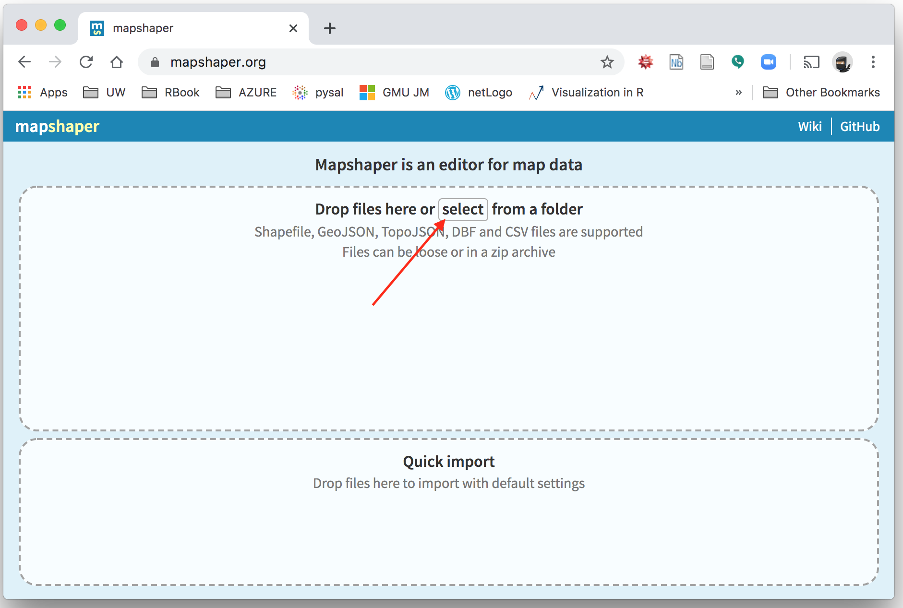
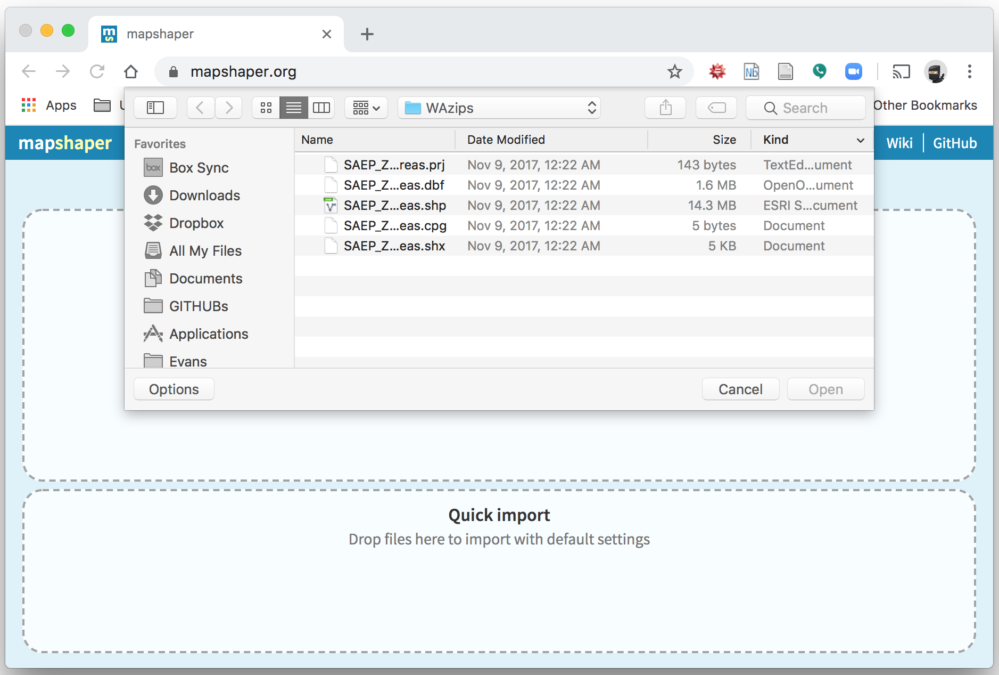
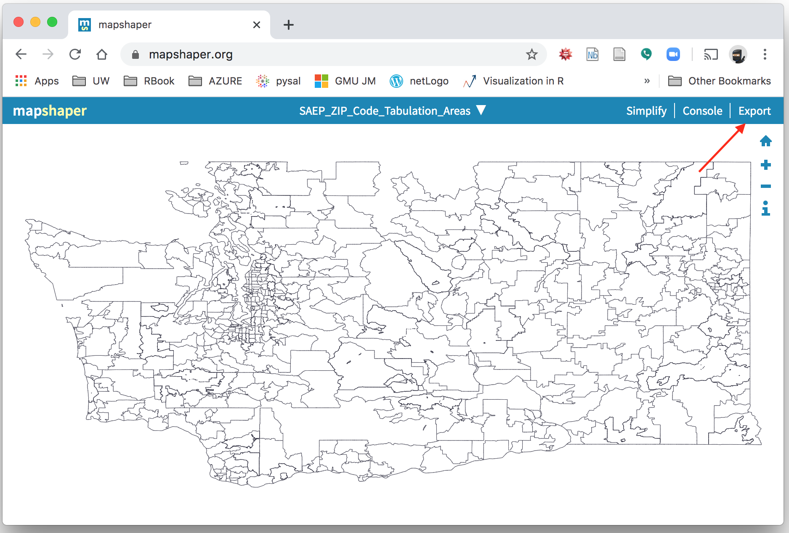
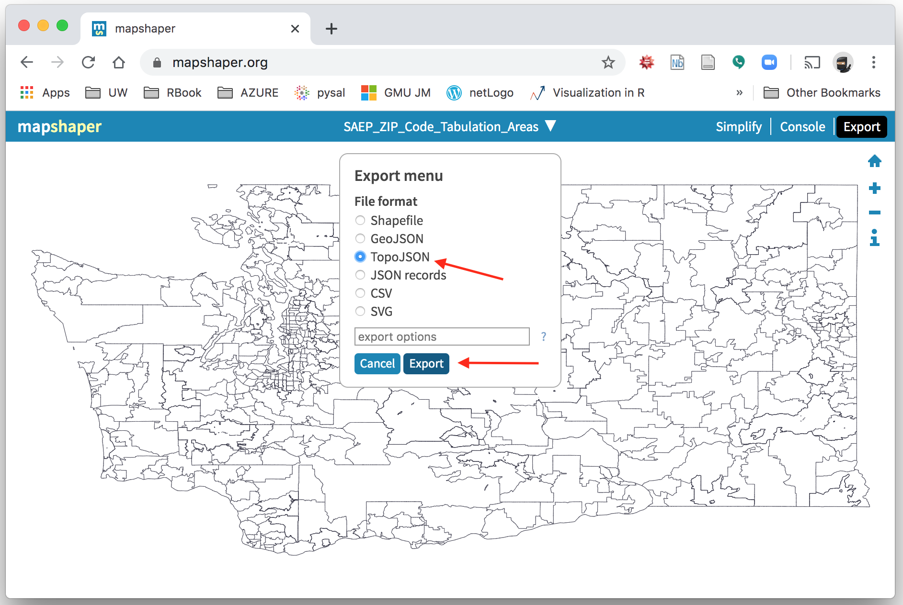

<br> 
<center></center>


## Course: VISUAL ANALYTICS FOR POLICY AND MANAGEMENT

### Prof. José Manuel Magallanes, PhD 
* Visiting Professor of Computational Policy at Evans School of Public Policy and Governance, and eScience Institute Senior Data Science Fellow, University of Washington.
* Professor of Government and Political Methodology, Pontificia Universidad Católica del Perú. 


_____


# Session 7: Spatial Data
_____


Let's work with the data on contributions to Candidates and Political Committees in Washington State. 

The WA [portal](https://data.wa.gov/) for OpenData has this data on this [website](https://data.wa.gov/Politics/Contributions-to-Candidates-and-Political-Committe/kv7h-kjye).


I have already prepare a data set, let's get it from GitHub:

```{r, eval=TRUE}
link='https://github.com/EvansDataScience/data/raw/master/contriWA.RDS'
#getting the data TABLE from the file in the cloud:
contriWA=readRDS(file=url(link))
```


This is what we have:

```{r, eval=TRUE}
str(contriWA,width = 60, strict.width = 'cut')
```

The data is per year, so let's check the years available:

```{r, eval=TRUE}
sort(unique(contriWA$election_year))
```

The data includes a spatial field we can take advantage of, the zip code:

```{r, eval=TRUE}
library(magrittr)
sort(unique(contriWA$contributor_zip))%>%head(20)
```

When you have a way to organize you data by a **column** that represents a **geographical unit**, you can plot your data on a map.

However, in the current format, each row represents a contribution; then, we need a data frame where each row is a ZIP code, and the other columns tell us, for example, some aggregate / summary value per zip code. For example, this is the total contributed per zip code 
```{r, eval=TRUE}
WA_zip_contri=aggregate(data=contriWA,amount~contributor_zip, sum)
```


```{r, eval=TRUE}
#see result 
str(WA_zip_contri)
```

The zip code should not be  number, so it is good we keep it as text.

Let's see the values of **amount**:

```{r, eval=TRUE}
summary(WA_zip_contri$amount)
```

Let's turn the values into a thousand unit:
```{r, eval=TRUE}
WA_zip_contri$amount=WA_zip_contri$amount/1000
```

This data frame has the sum of contributions for every zip code since the election year 2009, including the elections up to 2023.


## Getting the Map

You need a map where each element (shape) is a zip code, in this case for Washington State. I have shared that in Canvas (which I got from [here](https://www.ofm.wa.gov/washington-data-research/population-demographics/gis-data/census-geographic-files). Let me guide you how to produce the map in the format needed:

1. Go to Canvas files and download the map zip file in session 6.
2. Unzip that file in folder. You will get several files with the same name but different file type. This collection is known as the shapefile.
3. Go to the website of [mapshaper](https://mapshaper.org/). As I am showing in the image below, click on **select**.



4. When prompted, go to the folder with the shape file and select all of them:


5. Then click **import**: 


6. You will see the map, just click on **export**:



7. At the export menu, select **TopoJson**, and then **Export**:



8. Save the file in TopoJson format in to your computer. 
9. Upload the file to Github and copy the download link from GitHub.

This is my link (please change it to yours):
```{r, eval=TRUE}
mapLink="https://github.com/EvansDataScience/data/raw/master/WAzips.json"
```

With the help of **geojsonio**, we can get the map:

```{r, eval=TRUE}
library(geojsonio)
PROJmap="+proj=longlat +datum=WGS84 +no_defs +ellps=WGS84 +towgs84=0,0,0"
wazipMap=topojson_read(mapLink,crs=PROJmap,stringsAsFactors = FALSE)
```

Check size of map from cloud:

```{r, eval=TRUE}
object.size(wazipMap)
```

Solving issues that are generally present in map files:

```{r, eval=TRUE}
library(lwgeom)
wazipMap=st_make_valid(wazipMap)
```

Changes in object size:
```{r, eval=TRUE}
object.size(wazipMap)
```

Simplifying shapes:

```{r, eval=TRUE}
library(rmapshaper)
wazipMap=ms_simplify(wazipMap)
```

Changes in object size:
```{r, eval=TRUE}
object.size(wazipMap)
```

We have a map:

```{r, eval=TRUE}
library(ggplot2)
ggplot(data=wazipMap) + geom_sf()
```

Notice you can zoom in this way:

```{r, eval=TRUE}
# north is positive / south is negative
# east is positive / west is negative

ggplot(data=wazipMap) + 
    geom_sf() +
    coord_sf(xlim = c(-121, -123), 
             ylim = c(47, 48.5))
```

You could use this next to a another big map to focus in a particular area.

Let's see the columns available:

```{r, eval=TRUE}
names(wazipMap)
```


The column with the zip code has the name ZCTA5CE10, let's check its data type:
```{r, eval=TRUE}
str(wazipMap$ZCTA5CE10)
```


It is also text, the same as the contributions data frame. 

The, having common columns, we can merge. Keep in mind that as the  zip codes in each are under different column names, I tell the _merge_ function what columns to use:

```{r, eval=TRUE}
# put map first:
layerContrib=merge(wazipMap,WA_zip_contri, 
                   by.x='ZCTA5CE10', 
                   by.y='contributor_zip',
                   all.x=F) # if no coincidence don't keep shape.
```


There is a new map: *layerContrib*. However, this merged map may lack some zip codes, so we can prepare a **basemap**:

```{r, eval=TRUE,warning=FALSE}

# This will make just a border of the state
baseMap <- ms_dissolve(wazipMap)
```

This is the base map, which may help us show the missing shapes.
```{r, eval=TRUE}
ggplot(baseMap) + geom_sf()
```

### Case: Map polygons


We will plot the the **amounts contributed**, which will be organised into quintiles. Let's follow these steps:

1. Install and load the necessary packages:

```{r, eval=TRUE,warning=FALSE,message=FALSE,results='hide'}
library(RColorBrewer)
library(tmap)
```


2. Decide the amount of groups:

```{r, eval=TRUE}
numberOfClasses = 5
```

3. Decide colors for each group of shapes (I chose a palette from [here](http://colorbrewer2.org/)):
```{r, eval=TRUE}
colorForScale='YlGnBu' # color scale
```

4. Create intervals to plot:
```{r, eval=TRUE}
layerContrib$cut=cut_number(layerContrib$amount,numberOfClasses,
                            ordered_result=T,
                            dig.lab=5)
```

5. Plot map:

5.1 Plot basic version

```{r, eval=TRUE}
baseLayer=ggplot(data = baseMap) +geom_sf() 
layer1 = baseLayer + geom_sf(data = layerContrib, aes(fill=cut),color=NA,show.legend = T) +
                 scale_fill_brewer(palette = colorForScale,
                                   name = "Intervals by 1,000")
layer1    
```


5.2 Add elements


```{r, eval=TRUE}

library(ggspatial)

creditsText="EPSG: 4326\nProj=longlat\ndatum=WGS84"

layer1s =  layer1 + annotation_scale(location = "bl", 
                                     width_hint = 0.2,
                                     plot_unit = 'mi',
                                     unit_category='imperial',
                                     style='ticks'
                                     )

layer1ns =  layer1s + annotation_north_arrow(location = "tl",
                                             style = north_arrow_minimal,
                                             height = unit(0.3, "in")) 
layer1ns
```


### Case: Map points:

The dataframe _contriWA_ has columns with coordinates, which represent a point in a map:

```{r, eval=TRUE}
contriWA[,c(9:10)]%>% head()
```

Let's use those columns to create a  _spatial point data frame_, while making sure it has the same  coordinate system as our map:

```{r, eval=TRUE, warning=FALSE}

contriWA_geo= st_as_sf(contriWA, 
                       coords = c("Lon", "Lat"), #Coord colnames in that order
                       crs = sp::CRS(PROJmap))# assign a CRS of map
```

Verifying projection:

```{r, eval=TRUE}
library(tmaptools)
get_projection(contriWA_geo)
```

Our new spatial _points_ dataframe looks the same:
```{r, eval=TRUE}
names(contriWA_geo)
```

But it is not a simple data frame:

```{r, eval=TRUE}
class(contriWA_geo)
```


Now, plot the new map with the data fro 2010 (select the right character for the [point](http://www.endmemo.com/program/R/pchsymbols.php)) on top of our WA state map:


```{r, eval=TRUE}

contriWA_geo2010=contriWA_geo[contriWA_geo$election_year==2010,]

pointsMap= baseLayer + geom_sf(data = contriWA_geo2010, 
                               size = 1,shape=20, 
                               alpha=0.2,color = 'red')
pointsMap
```

You can change the shape of dots selecting different numbers:


### Case: Several maps to higlight groups:


Imagine you need the polygons at the bottom and top deciles:

```{r, eval=TRUE}
quantile(layerContrib$amount, c(.1,.9))
```


Sub maps:
```{r, eval=TRUE}
#filters:
top10=quantile(layerContrib$amount, c(.9))
bot10=quantile(layerContrib$amount, c(.1))

#newMaps!
mapBot=layerContrib[layerContrib$amount<=bot10,]
mapTop=layerContrib[layerContrib$amount>=top10,]
    
legendText="Areas to watch"
shrinkLegend=0.4
title="Top and Botton Average Contribution to elections in WA (2009-2023)"
```


Plotting the map:

```{r, eval=TRUE}
# one group
topLayer= baseLayer + geom_sf(data=mapTop,fill='red',color=NA) 
# other group
botTop  = topLayer+ geom_sf(data=mapBot,fill='green',color=NA) 

# altogether:
fullMap = botTop + annotate(x=-118.5,
                            y=45.7,
                            geom = 'text',
                            label=creditsText,
                            size=2)
fullMap
```


### Case: Arranging maps into a grid


If you need to plot more than one map:

```{r, eval=TRUE,fig.width=15, fig.height=15}
library(ggpubr)
layer1ns2=layer1ns + 
          theme(legend.background = element_rect(size=0.3,
                                                 linetype="solid",
                                                 colour ="grey"),
                legend.position = 'top',
                legend.text = element_text(size = 5),
                legend.title = element_text(size = 7)) +     
          guides(fill=guide_legend(title.position = "top",title.hjust = 0.5))

ggarrange(layer1ns2,fullMap,ncol = 1)
```


